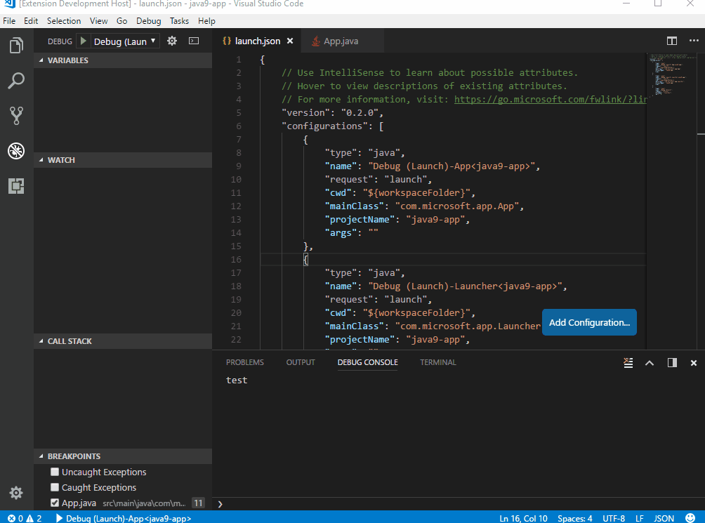

# Test Plan
## Hello World

 1. Create a new folder `helloworld`, create a file named `App.java` in this folder and filling the following codes:
<pre>
public class App 
{
    public static void main( String[] args )
    {        
        System.out.println( "Hello World!" );
    }
}
</pre>

2. Set BP on println
3. Press F5, verify for launch.json generated with right  `mainClass`
4. Press F5, verify for BP to be hit, verify variable args shows like `String[0] (id=%d)`
5. Add watch `args.toString() + " test"`, verify the result like `[Ljava.lang.String;@726f3b58 test`
6. Input `args.toString() + " test"` in debug console, verify the same result in debug console and it is expandable.
7. Verify stack with thread list and on paused thread and one stack:
     `App.main(String[]) (App.java:5)`
8. Press F10, verify  `Hello World!` in debug console.
9. Press F5, verify program terminates.

## Call Stack
1. Open test project `2.callstack`
2. Open `Bar.java`, set BP on line 3
1. Press F5, verify for launch.json generated with right `projectName` and `mainClass`
4. Press F5, verify for BP to be hit, verify variable args shows `i: 20` and `this: Bar (id=^d)`

1. Verify the stackframe shows:
    <pre>
    Bar.testBar(int) (Bar.java:3)
    Foo.testFoo(int) (Foo.java:6)
    CallStack.main(String[]) (CallStack.java:4)
    </pre>
1. Click the testFoo line in the call stack view, verify vscode views verify variable args shows `j: 10` and `this: Foo (id=^d)` and `this` is expandable with only member `bar: Bar (id=^d)`, the bar should not be expandable.
1. Change `j` to `32` and switch to stackframe `Bar.testBar(int) (Bar.java:3)` and switch back to `Foo.testFoo(int) (Foo.java:6)`, input `j + 1` in debug console and verify `33` is diplayed.
1. Add watch `this.bar.toString()` and verify the result `"Bar@^d" (id=^d)`
1. Add watch `"test" + new Bar().hashCode()` and verify the result `"test^d" (id=^d)`
1. Add watch `bar.testBar(j + 10)` and verify there is a message `This is test method in bar.` printed in debug console.
9. Press F5, verify program terminates.

## Call Stack
1. Open test project `2.callstack`
2. Open `Bar.java`, set BP on line 3
1. Press F5, verify for launch.json generated with right `projectName` and `mainClass`
4. Press F5, verify for BP to be hit, verify variable args shows `i: 20` and `this: Bar (id=^d)`

1. Verify the stackframe shows:
    <pre>
    Bar.testBar(int) (Bar.java:3)
    Foo.testFoo(int) (Foo.java:6)
    CallStack.main(String[]) (CallStack.java:4)
    </pre>
1. Click the testFoo line in the call stack view, verify vscode views verify variable args shows `j: 10` and `this: Foo (id=^d)` and `this` is expandable with only member `bar: Bar (id=^d)`, the bar should not be expandable.
1. Change `j` to `32` and switch to stackframe `Bar.testBar(int) (Bar.java:3)` and switch back to `Foo.testFoo(int) (Foo.java:6)`, input `j + 1` in debug console and verify `33` is diplayed.
1. Add watch `this.bar.toString()` and verify the result `"Bar@^d" (id=^d)`
1. Add watch `"test" + new Bar().hashCode()` and verify the result `"test^d" (id=^d)`
1. Add watch `bar.testBar(j + 10)` and verify there is a message `This is test method in bar.` printed in debug console.
9. Press F5, verify program terminates.

## Variables
1. Open test project `4.variable`

1. Set BP on the last statement of `VariableTest#test`
1. Press F5 to generate `launch.json` and press F5  again to start debug and wait for BP to be hit
1. Verify 
    1. `i` should be `111`
    1.  `nullstr` should be `null` 
    1.  `str` should be full displayed with 1000 `a` 
    1.  `object` should be `Object (id=^d)` and not expandable
    1.  `test` should be `VariableTest (id=^d)` and expandable with `x (VariableTest): 100`, `i:19099` and `x (Foo): 0`
    1.  `a` is not expandable
    1.  `b` is displayed as `Class (A) (id=^d)` and expand `b->classLoader`, there should be no errors on logs
    1.  `intarray` should have 3 integers `1, 2, 3`
    1.  `strList` should have children `size: 2` and expandable `elementData`, expand `elementData`, a long string `string test aaaaaaa...` should be displayed
    1.  `map` should have `size: 1` and expandable `table` with a `HashMap$Node` child.
    1.  `t` should have one element `hello`
    1.  `genericArray` should be displayed `String[10][] (id=^d)` with first non-empty element
    1. `multi` should be displayed `String[5][][] (id=^d)` and two levels expandable tree nodes.
    1. `d` should not be expandable
    1. `dd` should be displayed as `GenericsFoo (id=^d)` and should have one child `x: Foo (id=^d)` with only one child `x: 0`
    1. `list` should have only one element of `int[1] (id=^d)` at index `0`
    1.  `this` variable should be displayed
1. 
1. set value on `test->x (VariableTest)`, input value `1`, verify `this->x (VariableTest)` has also been changed to `1`

1. Open user settings and set 
    <pre>"java.debug.settings.showHex": true,
    "java.debug.settings.maxStringLength": 10,
    "java.debug.settings.showQualifiedNames": true,
    "java.debug.settings.showStaticVariables": false, </pre>
1. verify 
    1. numbers are displayed in hex, and static variable is hiden and class names have been changed to fully qualified, `str` should be changed to `"string ..." (id=0x^d)`
2. add watch `this.hashCode()` verify the result should be hex format.
1. add watch `str + str.length()` in debug console, verify the result `"string ..." (id=0x^d)`
1. Press F5, verify program terminates.

## Big stack frame
1. Open test project `6. recursivefunction`
2. Open `RecursiveTest.java`, and set BP on line 8: return 1
1. Press F5 to generate `launch.json` and press F5  again to start debug and wait for BP to be hit
1. Add watch `number + 100` and verify the call stack list is a long list, and you can switch between them freely with changed arguments number and changed watch values
1. click on the Load More Stack Frames button, verify you can click on it continually. (The total stack frame count is 1000, and vscode will load 20 of them in one page, so you can click Load More Stack Frames button about 50 times), verify there is no PERFORMANCE issue (no delay more than 1 second during the test steps).
1. Press F5, verify program terminates.

## Breakpoint and innner class
1. Open test project `5.breakpoint`
1. Change the code to:
```
class A {

    void m() {
        System.out.println("outer");
    }

    String n() {
        return "outer";
    }
}

public class BreakPointTest {
    public static void main(String[] args) {
        new BreakPointTest().go();
        int j = 0;
        new A() {
            @Override
            void m() {
                System.out.println("anonymous");
            }
        }.m();
        for (int i = 1; i <= 100; i++) {
            if (i <= 99) {
                j++;
            } else {
                System.out.println(j);
            }

        }
    }

    void go() {
        new A().m();
        class A {
            String n() {
                return "inner";
            }

            void m() {
                System.out.println("inner");
            }
        }
        new A().m();
    }

    static class A {
        String n() {
            return "middle";
        }

        void m() {
            System.out.println("middle");
        }
    }
}
```

1. Set BP on each `println` statement
1. Add watch `new A().n()`
1. Press F5 to start debug, verify the line `System.out.println("middle");` is hit, verify the watch result is `middle`
1. Press F5 again, verify the line `System.out.println("inner");` is hit, verify the watch result is displayed with red error message
1. press F5 again and verify the line `System.out.println("anonymous");` is hit and the watch result is `middle`
1. press F5 again and verify the line `System.out.println(j);` is hit and the watch result is `middle`
1. Press F5, verify the program stops, verify no error in logs. 
1. verify the following messages in debug console <pre>
middle
inner
anonymous
99
</pre>

## Variable Performance Test
1. Open test project `7.variableperformance`
2. Open `TooManyVariables.java`, and set BP on `System.out.println("variable perf test.")`
1. Press F5 to generate `launch.json` and press F5  again to start debug
1. Open debug view and expand the ‘this’ variable in variable view.
1. Verify the time for expanding are less than 5 seconds
1. Press F5, verify program terminates.

## No Debug Information Test
1. Open test project `8.nosource`
1. Open `NoSourceTest.java`, and set breakpoint on line 4: `System.out.println(i+10);`
1. Press F5 to generate `launch.json` and press F5  again to start debug, verify the BP is hit
1. Verify the following stack frames:
    <pre>
    NoSourceTest.lambda$0(Integer) (NoSourceTest.java:4)
    ^d.accept(Object) (Unknown Source:-1)
    Foo.bar(int,int,Consumer) (Unknown Source:-1)
    NoSourceTest.main(String[]) (NoSourceTest.java:3)
    </pre>
1. Select stack frame `Foo.bar(int,int,Consumer) (Unknown Source:-1)`, add watch `this.hashCode() - arg0` and verify an integer as the result, verify watch `new Foo()` results in  `Foo (id=^d)`
1. Press F5, verify program terminates.

## Maven Test
1. Open cmd.exe and create an empty folder and run `mvn archetype:generate –DarchetypeArtifactId:maven-archetype-quickstart`
    1. On `Define value for property 'groupId'` please input `com.ms.samples`
    1. On `Define value for property 'artifactId'` please input `simple-app`
    1. For other options, press Enter
1. Open generated `simple-app` folder using vscode
1. Wait and verify `.project` and `.classpath` files and `target` folder are generated.
1. Set BP on the `println`
1. Press F5 to generate `launch.json` and press F5  again to start debug, verify the BP is hit
1. Press F5, verify program terminates with output `Hello World!`

## Gradle Test
1.  create a new folder and create file `build.gradle` with the following text:
    <pre>
    apply plugin: 'java'

    // Redefine where to look for app and test code 
    // In this example, our code is structured as:
    // project
    //   └── src
    //       ├── main
    //       │   ├── java
    //       │   └── resources
    sourceSets {
        main.java.srcDirs = ['src/main/java']     
    }
    </pre>
1. copy the src/main folder from prevous test case `Maven Test` to this folder.
1. Set BP on the `println`
1. Press F5 to generate `launch.json` and press F5  again to start debug, verify the BP is hit
1. Press F5, verify program terminates with output `Hello World!`

## PetClinic
1. Clone code from `https://github.com/spring-projects/spring-petclinic.git`
1. Open the cloned project and verify `.project` and `.classpath` files and `target` folder are generated.
1. Set BP on `WelcomeController.java` on line `return "welcome";` and `main` on `PetClinicApplication.java`
1. Press F5 to generate `launch.json` and press F5  again to start debug, verify the BP on `main` is hit.
1. Press F5 and verify the BP on `main` is hit again.
1. Wait for output `2017-11-23 20:23:25.230  INFO 9448 --- [  restartedMain] s.b.c.e.t.TomcatEmbeddedServletContainer : Tomcat started on port(s): 8080 (http)
`
1. Open IE and navigate to `http://localhost:8080`, verify the `welcome` method is hit
1. Press F5 and verify page like `spring-petclinic/target/classes/templates/welcome.html` is displayed on IE with `bad` css.
1. STOP debug and do the test again from step 4

## TODO application
1. Clone code from `https://github.com/Microsoft/todo-app-java-on-azure.git`
1. Open the cloned project and verify `.project` and `.classpath` files and `target` folder are generated.
1. Open file `todo-app-java-on-azure\src\main\resources\application.properties` and replaces it with a test configuration(see my email attachment)
1. Set BP on `TodoListController.java` on `addNewTodoItem(@RequestBody TodoItem item)` and `main` on `TodoApplication.java`
1. Press F5 to generate `launch.json` and press F5  again to start debug, verify the BP on `main` is hit.
1. Press F5 to continue, open IE and open `http://localhost:8080/#/TodoList` and add a todo, press Button `Add` and verify the BP on addNewTodoItem is hit, wait a little time to load the stack frame.
1. Press F10 and then Press F5, verify the todo item is added.


## Single file build
1. Open file in folder `21.single-file`.(`Open folder` or `Open file`)
2. Press F5, make sure it debugs well.
3. update the src to introduce a compilation error. For example, change `String s = "1";` to `String s = 1;`. Then hit F5, check whether vscode pop out an error message "Build fails, do you want to proceed", click `abort`, make sure there is no more error message. 

## Console application

1. Open project `23.console-app` in vscode.
2. Press `F5` choose java and make sure `launch.json` is generated.
3. Press `F5` again to start debug.
4. See VSCode `DEBUG CONSOLE` view, verify the program is blocking at the line `Please input your name:`.
5. Terminate debugger.
6. Go to `launch.json`, change the option `console` to `integratedTerminal`.
7. Press `F5` again.
8. See VSCode `TERMINAL` view, and user can input his/her name there and the program continue to run.
9. Terminate debugger.
10.Go to `launch.json`, change the option `console` to `externalTerminal`.
11. Press `F5` again, and the debugger will pop up an external terminal (e.g. cmd.exe).
12. User can input his/her name there and the program continue to run.

## Java 9 modular application

1. In your PC, install latest java 9 JDK, configure `JAVA_HOME`.
2. Open project `19.java9-app` in vscode.
3. Press `F5` choose java and verify `launch.json` is auto generated.
4. Press `F5` to start debug.
5. Verify `breakpoint` and `step` work.
6. Click `Call Stack`, it will open the associated source file in VSCode correctly.

## Multi-root

1. Clone code from https://github.com/spring-projects/spring-petclinic.git
2. Clone code https://github.com/Microsoft/todo-app-java-on-azure.git
3. Open both above projects in the same VSCode windows under workspace features
4. Navigate to the Debug view
5. Generate configuration for sprintclinic
6. Generate configuration for TODO
7. Check both launch.json to see the selected project's main are generated. 

# Step Filters

1. Open project `19.java9-app` in vscode.
2. Follow gif to verify step filters feature.


The new gif:


## Hot Code Replace

1. Open project `24.hotCodeReplace` in vscode.
2. Set breakpoints:  NameProvider.java line 12; Person.java line 13
3. Press `F5`  to start debug.
4. The program stopped at the Person.java line 13
5. Change the value of the line "old" to "new"
5. Save the document to trigger HCR. Check the breakpoint will stop at line 12 
6. Click F10 to step over, check the value of `res` on the debug view of local variable which should be `new`

## Conditional Breakpoints

1. Open project `simple-java` in vscode, write the following code:
<pre>
package com.ms.samples;

/**
 * Hello world!
 *
 */
public class App
{
    public static void main( String[] args )
    {
        int i = 0;
        for (; i <= 1000; i++) {
            if (i == 1000)  {
                System.out.println( "Hello World!" );        
            }
        }
        System.out.println( "Hello World!" );
    }
}  

</pre>

2. set conditional breakpoint on line 13  with condition `i ==1000`, F5 and wait the breakpoint to be hit


3. verify i equals 1000 in variable window.
4. F5 and wait for program to exit.

## Restart Frame

1. Open project `25.restartFrame` in vscode.
2. Set breakpoint:  Person.java line 28
3. Press `F5`  to start debug.
4. The program stopped at the Person.java line 28
5. Open the debug view, find the call stack of current breakpoint
6. Right click the `HelloWorld$1.run()`, choose `Restart Frame`.  Result: It should fail with error message in the right corner.
7. Right click the `Persona.getInternalName()`, choose `Restart Frame`. Result: The program stop at the entry of getInternalName 
7. Right click the `Persona.getName()`, choose `Restart Frame`. Result: The program stop at the entry of getName. The above call stacks are popped.

## Encoding Test for project under chinese directory

1. Find some project under chinese characters directory.
2. Open it in vscode.
3. Press `F5` to start debug.
4. Verify the program can be launched normally.


## Encoding Test for text file encoding

1. Open a hello world project, and print `System.out.println("中文字符3323")`.
2. Press F5 to start debug.
3. Verify the output in DEBUG CONSOLE view is correctly displayed.


## Caught and Uncaught exceptions test

1. Open project `simple-java` in vscode, change code from line12 to line16 with following code:
```
for (; i <= 1000; i++) {
     if (i == 1)  {
         throw new IllegalStateException();
      }
 }
```
2. Open debug view and tick both Uncaught exceptions and Caught exeptions
3. Press F5, verify progress stop at line 14
4. Press F5 again, verify following messages in debug console
```
Exception in thread "main" java.lang.IllegalStateException
	at com.ms.samples.App.main(App.java:14)
```


## Restart Frame

1. Open project `25.restartFrame` in vscode.
2. Set breakpoint:  Person.java line 28
3. Press `F5`  to start debug.
4. The program stopped at the Person.java line 28
5. Open the debug console, input `s` or `g` , the auto complete window will pop up with intellisense support.

## Logpoint

1. Open a project in vscode, and add a logpoint. The log message is the simple text message. If you want to print the expression, you need wrap it with a curly bracket `{ javaExpression }`.
2.  Launch java debugger and continue your program.
3. When the logpoint code branch is hit, it just log the message to the console and doesn't stop your program.


## Start without debugging
1. Open a Hello world project in VS Code.
2. Set a breakpoint.
3. Press <kbd>Ctrl+F5</kbd> to start without debugging.
4. Verify that the program starts without hitting the breakpoint. 
5. Open a spring-boot project in VS Code.
6. Press <kbd>Ctrl+F5</kbd> to start without debugging.
7. Verify that the program starts, and there is no information in "watch" and "callstack" view.
8. Click the "pause" button in the toolbar, it should NOT pause the program.
9. Click the "stop" button in the toolbar, it should stop the program.


## Environment Variables
1. Open `26.environmentVariables` in vscode.
2. Press <kbd>F5</kbd> to start.
3. Verify the output in Debug Console should be as following:
    ```
    CustomEnv: This env is for test plan.
    SystemPath: <value of PATH >
    ```

## Runtime classpath entry
1. Open `27.runtimeClassEntry` in vscode.
2. Press <kbd>F5</kbd> to start.
3. Verify the output in Debug Console should be as following:
    ```
      Tomcat started on port(s): 8080 (http)
    ```
