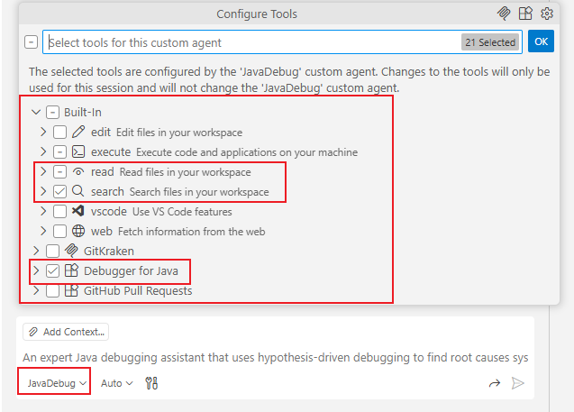
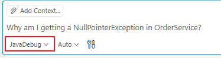
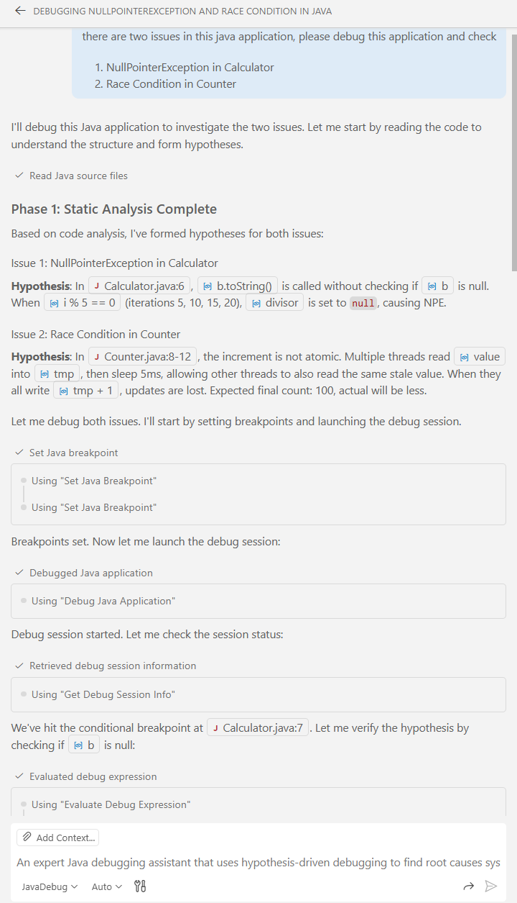

# Java Debug Agent

The Java Debug Agent is an AI-powered debugging assistant that integrates with GitHub Copilot Chat to help you debug Java applications using natural language.

## Overview

Instead of manually setting breakpoints and inspecting variables, you can simply describe your debugging task in natural language. The agent will:

1. Analyze your code to form hypotheses
2. Set targeted breakpoints
3. Inspect variables and evaluate expressions
4. Find the root cause of bugs

## Requirements

- VS Code 1.95.0 or later
- [Language Support for Java by Red Hat](https://marketplace.visualstudio.com/items?itemName=redhat.java)
- [Debugger for Java](https://marketplace.visualstudio.com/items?itemName=vscjava.vscode-java-debug)
- GitHub Copilot Chat extension

## Getting Started

### 1. Open Copilot Chat

Press `Ctrl+Shift+I` (Windows/Linux) or `Cmd+Shift+I` (macOS) to open Copilot Chat.

### 2. Switch to JavaDebug Agent Mode

In the Copilot Chat panel, click on the agent selector (usually shows "Copilot" or current agent name) and select **JavaDebug** from the dropdown list.


<!-- TODO: Add screenshot showing agent selector dropdown -->

### 3. Enter Your Debugging Request

Once in JavaDebug mode, simply type your debugging request:

```
Why am I getting a NullPointerException in OrderService?
```


<!-- TODO: Add screenshot showing chat input -->

### 4. Let the Agent Work

The agent will:
- Read relevant code files
- Form a hypothesis about the bug
- Set breakpoints at strategic locations
- Start or attach to a debug session
- Inspect variables to verify the hypothesis
- Report the root cause


<!-- TODO: Add screenshot showing agent analyzing code -->

## Example Usage

### Debug a NullPointerException

```
I'm getting NPE when calling userService.getUser()
```

The agent will:
1. Read `UserService.java`
2. Hypothesize which variable might be null
3. Set a breakpoint before the NPE
4. Check variable values
5. Report: "The `user` variable is null because `findById()` returns null when ID doesn't exist"

### Debug Wrong Calculation Result

```
The calculateTotal() method returns wrong value
```

### Debug with Specific Input

```
Debug processOrder with orderId=456
```

### Debug Multi-threaded Issues

```
I suspect a race condition in the worker threads
```

## Agent Capabilities

| Capability | Description |
|------------|-------------|
| **Start Debug Session** | Launch or attach to Java applications |
| **Set Breakpoints** | Set conditional or unconditional breakpoints |
| **Inspect Variables** | View local variables, fields, and objects |
| **Evaluate Expressions** | Execute Java expressions in debug context |
| **Step Through Code** | Step over, step into, step out |
| **Multi-thread Support** | Debug concurrent applications |
| **Stack Trace Analysis** | View and navigate call stacks |

## How It Works

The agent uses **hypothesis-driven debugging**:

```
┌─────────────────────────────────────────┐
│  1. STATIC ANALYSIS                     │
│     Read code, understand the problem   │
└─────────────────┬───────────────────────┘
                  ↓
┌─────────────────────────────────────────┐
│  2. FORM HYPOTHESIS                     │
│     "Variable X is null at line Y"      │
└─────────────────┬───────────────────────┘
                  ↓
┌─────────────────────────────────────────┐
│  3. SET BREAKPOINT                      │
│     At the location to verify           │
└─────────────────┬───────────────────────┘
                  ↓
┌─────────────────────────────────────────┐
│  4. VERIFY                              │
│     Check if hypothesis is correct      │
│     ├─ YES → Report root cause          │
│     └─ NO  → Form new hypothesis        │
└─────────────────────────────────────────┘
```

## Tips for Best Results

### Stay in Agent Mode

Make sure you're in **JavaDebug** agent mode (check the agent selector in Chat panel). If you switch back to default Copilot mode, the debugging tools won't be available.

### Be Specific

```
✅ Good: "Why does getUserById return null when id=123?"
❌ Vague: "Something is wrong"
```

### Mention the Error

```
✅ Good: "Getting ArrayIndexOutOfBoundsException in processItems()"
❌ Vague: "Debug processItems"
```

### Provide Context

```
✅ Good: "The order total is $0 instead of $150 for order 456"
❌ Vague: "Wrong calculation"
```

## Troubleshooting

### Agent Can't Find the File

Make sure the Java project is properly loaded. Check that:
- The Java extension is activated (look for Java icon in status bar)
- The project is imported (check Java Projects view)

### Debug Session Won't Start

Ensure:
- Your project compiles successfully
- No other debug session is running
- The main class can be found

### Breakpoint Not Hit

The agent will tell you to trigger the scenario. You need to:
1. Run the part of your application that executes the code
2. The breakpoint will be hit when the code path is executed

## Limitations

- Requires an active Java project with proper configuration
- Cannot debug remote applications without proper attach configuration
- Performance may vary with large codebases

## Feedback

If you encounter issues or have suggestions, please:
- File an issue on [GitHub](https://github.com/microsoft/vscode-java-debug/issues)
- Include the agent's response and your debugging request

## See Also

- [Debugger for Java Documentation](https://github.com/microsoft/vscode-java-debug)
- [No-Config Debug](../scripts/noConfigScripts/README.md)
- [Troubleshooting Guide](../../Troubleshooting.md)
